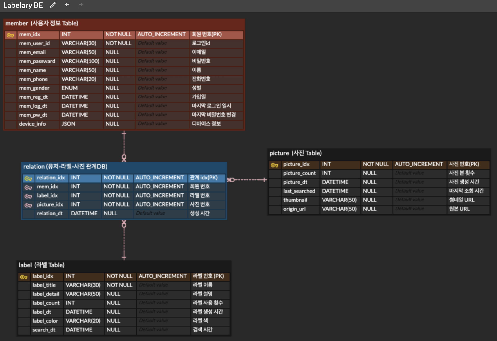

# DB 설계

## 1. 도메인 설계 및 엔티티 분석

- 사용자
- 라벨
- 사진

> 1. 사용자는 디바이스(스마트폰)로 `Labelary App` 을 이용
> 2. 사진은 기본적으로 스마트폰 캡쳐 기능으로 **캡쳐한 사진**을 의미
> 3. 사진에는 여러개의 라벨이 붙을 수 있음
> 4. 라벨도 여러 사진에 적용될 수 있음
> 5. (3-4)조건을 만족하기 위해 `사용자-사진-라벨` 관계를 위한 테이블 필요

## 2. 테이블 설계

네이밍 컨벤션은 [SQL style guide](https://www.sqlstyle.guide/) 를 참고

