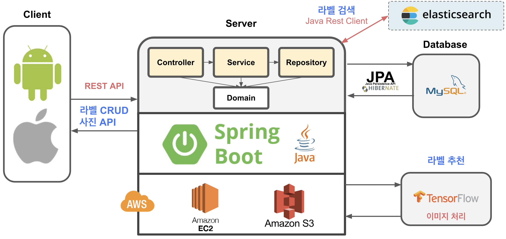

# 애플리케이션 아키텍쳐



## 계층형 구조

| package | 설명 |
|:---:|:---|
| `Controller` | App 계층 |
| `Service` | 비즈니스 로직, 트랙잭션 처리 |
| `Repository` | JPA 직접 사용, 엔티티 매니저 사용 |
| `Domain` | 엔티티 계층, 모든 계층에서 접근 |

## 프로젝트 구조

``` bash
fullstack.labelary
  |-api             # API 관련
  |-controller      # App 계층
  |-domain          # Entity
  |-exception       # 예외 처리
  |-repository      # JPA 사용
  |-service         # 비즈니스 로직
```

