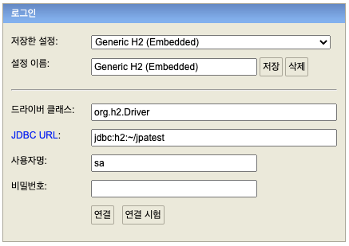
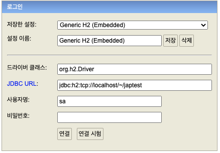

# H2 DB와 JPA 설정

## 1. H2 데이터베이스 설치

- https://www.h2database.com
- 개발이나 테스트 용도로 사용하기 좋은 DB
- Web Admin 페이지를 제공

### 1-1. H2 연결 설정

> 처음 연결할 때 파일 시스템으로 연결해서 로컬에 저장될 파일을 만들어 주어야 함

파일생성 → jdbc:h2:~/jpatest



> `~/jpatest.mv.db` 파일이 생성된 것을 확인

연결(네트워크mode) → jdbc:h2:tcp://localhost/~/jpatest



## 2. JPA와 DB 설정

`main/resources/application.yml`

```bash
spring:
  datasource:
    url: jdbc:h2:tcp://localhost/~/jpatest
    username: sa
    password:
    driver-class-name: org.h2.Driver
  jpa:
    hibernate:
      ddl-auto: create
    properties:
      hibernate:
        # show_sql: true # System.out 으로 출력
        format_sql: true
logging.level:
  org.hibernate.SQL: debug # Log 남김
# org.hibernate.type: trace
```

## 2-1. DB 연동 확인

### 회원 엔티티

```java
package jpatest.yjpark;

import lombok.Getter;
import lombok.Setter;

import javax.persistence.Entity;
import javax.persistence.GeneratedValue;
import javax.persistence.Id;

@Entity
@Getter @Setter
public class Member {

    @Id @GeneratedValue
    private Long id;
    private String username;

}
```

### 회원 레포지토리

```java
package jpatest.yjpark;

import org.springframework.stereotype.Repository;

import javax.persistence.EntityManager;
import javax.persistence.PersistenceContext;

@Repository
public class MemberRepository {

    @PersistenceContext
    private EntityManager em;

    public Long save(Member member) {
        em.persist(member);
        return member.getId();
    }

    public Member find(Long id) {
        return em.find(Member.class, id);
    }
}
```

### 테스트

```java
package jpatest.yjpark;

import org.assertj.core.api.Assertions;
import org.junit.Test;
import org.junit.runner.RunWith;
import org.springframework.beans.factory.annotation.Autowired;
import org.springframework.boot.test.context.SpringBootTest;
import org.springframework.test.annotation.Rollback;
import org.springframework.test.context.junit4.SpringRunner;
import org.springframework.transaction.annotation.Transactional;

@RunWith(SpringRunner.class)
@SpringBootTest
public class MemberRepositoryTest {

    @Autowired MemberRepository memberRepository;

    @Test
    @Transactional
    @Rollback(false)
    public void testMember() {
        // given
        Member member = new Member();
        member.setUsername("memberA");

        // when
        Long savedId = memberRepository.save(member);
        Member findMember = memberRepository.find(savedId);

        // then(검증)
        Assertions.assertThat(findMember.getId()).isEqualTo(member.getId());
        Assertions.assertThat(findMember.getUsername()).isEqualTo(member.getUsername());
        Assertions.assertThat(findMember).isEqualTo(member); // JPA 엔티티 동일성 보장
    }
}
```